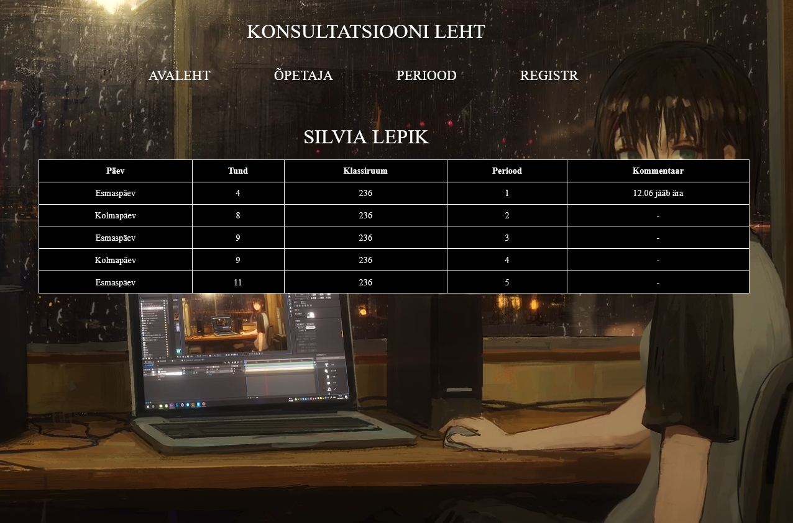

# Kasutaja Dokumentatsioon

See dokumentatsioon kirjeldab `kasutaja.php` skripti funktsionaalsust.


## Kirjeldus

See PHP skript toob ja kuvab andmeid andmebaasist konsultatsioonide kohta. See võimaldab kasutajatel filtreerida konsultatsioone õpetaja nime ja perioodi järgi.

## Kasutamine

Selle skripti kasutamiseks lisage see oma projekti ja veenduge, et järgmised failid oleksid olemas:

- `navi.php`: Navigeerimisfail
- `conf.php`: Konfiguratsioonifail
- `kasutaja.css`: CSS-fail stiilide jaoks

Veenduge, et andmebaasiühendus oleks õigesti konfigureeritud `conf.php` failis.

## Funktsioonid

### `printTable($data)`

See funktsioon trükib HTML-tabeli antud andmejada põhjal.

- Parameetrid:
  - `$data`: Konsultatsioonide andmete massiiv

## Sõltuvused

- PHP (koos MySQLi laiendusega)

## Paigaldamine

1. Kloonige repositoorium.
2. Paigutage vajalikud failid (`navi.php`, `conf.php`, `kasutaja.css`) vastavatesse kohtadesse.
3. Konfigureerige andmebaasiühendus `conf.php` failis.
4. Pääsege skriptile juurde veebiserveri kaudu koos PHP-toega.

## Kasutajate leht pilt


# Registreerimisvormi dokumentatsioon

See dokument sisaldab PHP-ga loodud registreerimisvormi kirjeldust ja näiteid.

## Paigaldus

1. Laadige PHP-failid oma veebiserverisse.
2. Looge andmebaas koos vajalike tabelitega
3. Muutke ühenduse konfiguratsioonifailis (conf.php) andmebaasi ühenduse seadeid vastavalt teie keskkonnale.

## Juhendid

1. Avage registreerimisvorm veebibrauseris.
2. Valige päev, õpetaja nimi, tund ja periood vastavalt vajadusele.
3. Klõpsake nuppu "Registreeri".
4. Kuvatakse teade edukast registreerumisest.


# Registreerimisevormi dokumentatsioon

Registreerimisevorm võimaldab kasutajatel luua uue konto saidil. See võimaldab neil sisestada kasutajanime ja parooli ning seejärel salvestada need andmebaasi.

## PHP-skripti selgitus

PHP-skript vastutab registreerimisvormi töötlemise eest. Siin on mõned olulised punktid:

- Kontrollitakse, kas POST-päringuga on saadetud kasutajanime ja parooli andmed.
- Kui andmed on saadetud, puhastatakse need ja salvestatakse andmebaasi pärast parooli soolamist.
- Kui registreerimine on edukas, kuvatakse sõnum "Registreerimine õnnestus" ja kasutaja sessioon muudetakse mitteadministraatoriks (onAdmin = 0).
- Kui registreerimine ebaõnnestub, kuvatakse vastav sõnum.

## HTML-vorm

Registreerimisevorm on loodud HTML-is ja see sisaldab välju kasutajanime ja parooli sisestamiseks. Vorm on loodud POST-meetodiga, mis saadab kasutaja sisestatud andmed PHP-skriptile töötlemiseks.

## JavaScript

JavaScript funktsioonid avavad ja sulgevad registreerimise modaalakna ning registreerimispaneeli.

Failid:
- `conf.php`: konfiguratsioonifail
- `logstylee.css`: stiilide fail
- `sun.mp4`: taustavideo
- `README.md`: projekti README fail


## Näited

### Kõikide konsultatsioonide kuvamine:

```php
<?php
// Sisaldame navigatsioonifaili
include('navi.php');

// Laadime konfiguratsioonifaili
require('conf.php');

// Määrame ühenduse globaalseks muutujaks
global $yhendus;

// Funktsioon tabeli väljastamiseks
function printTable($data)
{
    echo "<table id='data-table'>";
    echo "<tr>";
    echo "<th>Päev</th>";
    echo "<th>Tund</th>";
    echo "<th>Klassiruum</th>";
    echo "<th>Periood</th>";
    echo "<th>Kommentaar</th>";
    echo "</tr>";

    foreach ($data as $row) {
        echo "<tr>";
        echo "<td>" . htmlspecialchars($row['paev']) . "</td>";
        echo "<td>" . htmlspecialchars($row['tund']) . "</td>";
        echo "<td>" . htmlspecialchars($row['klassiruum']) . "</td>";
        echo "<td>" . htmlspecialchars($row['periood']) . "</td>";
        echo "<td>" . htmlspecialchars($row['kommentaar']) . "</td>";
        echo "</tr>";
    }

    echo "</table>";
}

// Laadime õpetajate andmed
$kask_select_opetajad = $yhendus->prepare("SELECT DISTINCT opetajaNimi FROM konsultatsioon");
$kask_select_opetajad->execute();
$result_opetajad = $kask_select_opetajad->get_result();
$opetajad = $result_opetajad->fetch_all(MYSQLI_ASSOC);

// Laadime perioodide andmed
$kask_select_perioodid = $yhendus->prepare("SELECT DISTINCT periood FROM konsultatsioon");
$kask_select_perioodid->execute();
$result_perioodid = $kask_select_perioodid->get_result();
$periods = $result_perioodid->fetch_all(MYSQLI_ASSOC);

// Valitud õpetaja ja perioodi salvestamine
$selectedTeacher = isset($_GET['opetaja']) ? urldecode($_GET['opetaja']) : '';
$selectedPeriod = isset($_GET['periood']) ? $_GET['periood'] : '';

// Kui on valitud õpetaja või periood
if ($selectedTeacher || $selectedPeriod) {
    // Kui on valitud mõlemad
    if ($selectedTeacher && $selectedPeriod) {
        $kask_select = $yhendus->prepare("SELECT paev, tund, klassiruum, periood, kommentaar, opetajaNimi FROM konsultatsioon WHERE opetajaNimi = ? AND periood = ?");
        $kask_select->bind_param("ss", $selectedTeacher, $selectedPeriod);
    } elseif ($selectedTeacher) {
        // Kui on valitud ainult õpetaja
        $kask_select = $yhendus->prepare("SELECT paev, tund, klassiruum, periood, kommentaar, opetajaNimi FROM konsultatsioon WHERE opetajaNimi = ?");
        $kask_select->bind_param("s", $selectedTeacher);
    } else {
        // Kui on valitud ainult periood
        $kask_select = $yhendus->prepare("SELECT paev, tund, klassiruum, periood, kommentaar, opetajaNimi FROM konsultatsioon WHERE periood = ?");
        $kask_select->bind_param("s", $selectedPeriod);
    }
    $kask_select->execute();
    $result = $kask_select->get_result();
    $data = $result->fetch_all(MYSQLI_ASSOC);

    // Trükime tabeli välja
    printTable($data);
} else {
    echo "<p>Valige filtreerimiseks õpetaja ja/või periood.</p>";
}

?>


